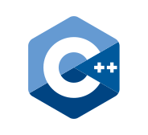
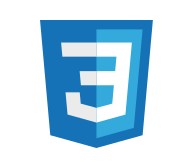
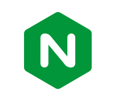
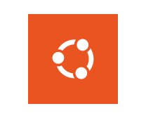
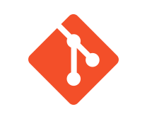
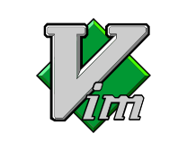

<h1>Hello World :smiley:</h1>

Student architect in digital technology at 42 school, passionate about innovation and the design of digital solutions.

<h2>My skills :rocket:</h2>
<h3 align="center">Languages</h3>

	
	
	
	
	

<h3 align="center">DevOps</h3>

	
	

<h3 align="center">Server & reverse proxy</h3>

	

<h3 align="center">Data & Streaming</h3>

	
	
	

<h3 align="center">Security</h3>

	
	

<h3 align="center">Architecture</h3>

	

<h3 align="center">Operating System</h3>

	
	
	
	
	

<h3 align="center">Tools</h3>

	
	
	
	

<h2>My projects :bookmark_tabs:</h2>
